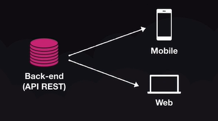
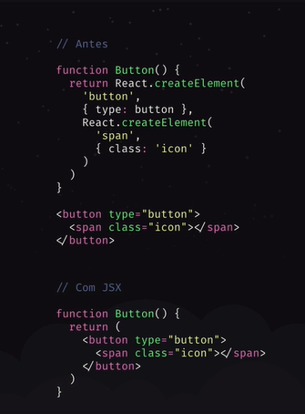

# Conceitos ReactJS

 - Biblioteca para construção de interfaces
 - Utilizado para a construção de Single-Page Applications (SPA)
 - Chamado de framework devido a todo o sue ecosistema
 - Tudo fica dentro do JavaScript (CSS, HTML, imagens)
 - React - Biblioteca que contem o core
 - ReactJS - React + itens eessenciais para o seu funcionamento na web, como o React router DOM
 - React Native - React + itens essenciais para o seu funcionamento no mobile, Bridges para acesso as API's nativas do Android e IOS


```jsx
// Exemplo de sintaxe do react e seu funcionamento

// importamos a biblioteca do react
import React from 'react'

// importamos o arquivo que contem codigo CSS
import './button.css'
// importamos uma imagem
import icon from './button.png'

// A funcao Button que contem um codigo HTML no seu return, que nos retorna um JSX que sao elementos como os elementos HTML, usados pelo react
function Button() {
	return(
		<button>
			
		</button>
	)
}
```

## Vantagens

- Organização do código
    - Componentização - quando você consegue isolar um codigo/funcionalidade e ela não interfere no restante da aplicação, isso é um componente. Componente é conjunto de lógica, HTML e CSS.
- Divisao de responsabilidades
    - Backend: Regra de negocio
    - Front-end: Interface

- Uma API, multiplos clientes



- Programação declarativa - fala qual resultado esperamos, e  ela se comporta conforme altera o estado na nossa aplicação
- Programação imperativa - o dev descreve cada passo que o programa deve executar

## JSX

- Permite escrever HTML dentro do JavaScript. O JSX facilita escrevermos nossos componentes enquanto se encarrega de construir a estrutura da arvore DOM e seus atributos
- Com React podemos criar nossos próprios elementos



## Babel / WebPack

O browser não vai entender todo o nosso código, por isso utilizamos o Babel e o Webpack 

- Babel - Convert o código JS de uma forma que o browser entenda, faz uma transpilação
- Webpack
    - Criação do bundle, arquivo com todo o código da aplicação
    - Ensina ao JavaScript como importar arquivos CSS, imagens e etc
    - Live reload com o webpack Dev Server

## Configurando um projeto ReactJS do zero

Será criada toda a estrutura que já vem pronta no create-react-app

```bash
# Criando a pasta do projeto
mkdir frontend && cd frontend

# Inicializado o projeto
yarn init -y

# criando pastas da nossa estrutura
mkdir src && mkdir public

# Abrindo o VSCode
code .
```

Com o VSCode aberto, vamos instalar a biblioteca do react e também o react-dom

```bash
# react é a biblioteca core do react e reac-dom é a integração do react 
# com a ávore de elementos HTML chamada de DOM
yarn add react react-dom
```

Para seguir vamos utilizar duas ferramentas

- BABEL → Converter (transpilar) código do React para um código que o browser entenda. A principal funcionalidade do babel é converter o js ES6+ para um js que a maioria dos browsers entendam
- WEBPACK → Pra cada tipo de arquivo (.js, .css, .png) vai converter o código de uma maneira diferente
    - Loarders: babel-loader, css-loader, image-loader → O webpack utiliza esses loaders para carregarmos outros arquivos além do .js dentro do javascript

Crie um arquivo index.html dentro da pasta public com o seguinte conteúdo

```html
<!DOCTYPE html>
<html lang="en">
<head>
    <meta charset="UTF-8">
    <meta name="viewport" content="width=device-width, initial-scale=1.0">
    <title>ReactJS</title>
</head>
<body>
    <div id="app"></div>
</body>
</html>
```

Instalando dependências

```bash
# Instalando dependências necessárias do webpack e babel no nosso projeto
yarn add @babel/core @babel/preset-env @babel/preset-react webpack webpack-cli

# Criando arquivo de configuração babel.config.js na raíz do nosso projeto
touch babel.config.js
```

Dentro do arquivo de configuração do babel vamos exportar um objeto com as seguintes configurações

```jsx
module.exports = {
    presets: [
				// @babel/preset-env converte o código js mais moderno em um código js mais antigo, mas baseado no nosso ambiente
        "@babel/preset-env",
				// @babel/preset-react adiciona as funcionalidades do react no javascript
        "@babel/preset-react"
    ]
}
```

Após essas configurações podemos ver o babel entrando em ação

Crie um arquivo chamado index.js dentro da pasta src com o seguinte conteúdo

```jsx
// Essa função utilizando arrow function ainda não é suportada por todos os browsers
// vamos usar o babel para converte-la
const soma = (a, b) => {
    return a + b
}

console.log(soma(2,3))
```

Vamos instalar o babel cli para executarmos a função

```bash
# instalando o cli do babel
yarn add @babel/cli

# executando o index.js e usando a flag --out-file para definirmos o local do nosso arquivo transpilado
yarn babel src/index.js --out-file public/bundle.js
```

Ao abrirmos o arquivo bundle.js vemos que ele contém também a função soma, mas escrita de uma maneira diferente, uma maneira que todos os browsers entendem

```jsx
"use strict";

var soma = function soma(a, b) {
  return a + b;
};

console.log(soma(2, 3));
```
